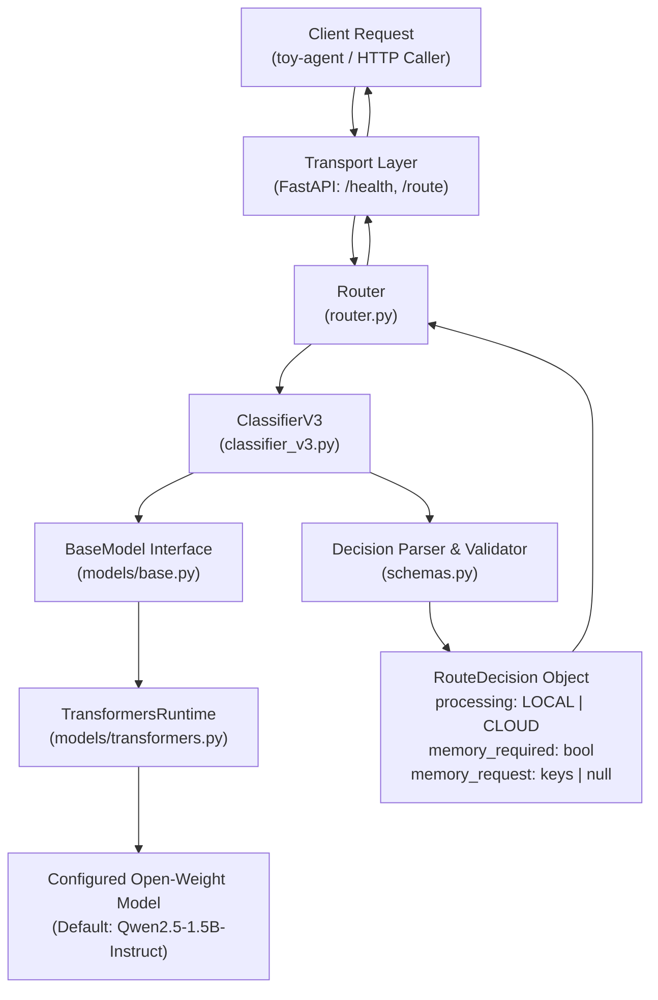

# SLM Router — System Architecture

## 1. System Overview

**SLM Router** is an on-device request classification and memory planning engine designed for agentic systems (such as `toy-agent`). It evaluates incoming natural language queries using an on-device Small Language Model (SLM) and returns a structured routing decision:

1. **`LOCAL` vs `CLOUD` Processing**:
   - **`LOCAL`**: Conversational chit-chat, simple math, factual explanations, personal context queries, and device actions/commands (the client executes device actions locally).
   - **`CLOUD`**: Real-time external lookups (e.g., weather, news, stocks) and heavy generation tasks exceeding local capacity (e.g., 500+ word essays, research reports, system architecture).
2. **Memory Metadata**:
   - `memory_required`: Boolean indicating whether stored user profile information or personal facts are required.
   - `memory_request`: Semantic identifier keys needed to answer the query (e.g., `["favorite_animal"]`, `["child_name", "favorite_animal"]`), returning keys only and never values.



### Architectural Principles

1. **Pure Decision Service**: The router does not generate conversational responses, call external APIs, query memory databases, or execute commands. It provides decision intelligence to the agent.
2. **Deterministic Output**: Output is constrained to a strict JSON schema via prompt engineering and verified through robust Pydantic validation.
3. **Model Decoupling**: The routing engine communicates through the `BaseModel` abstract interface, keeping routing and schema logic independent of the underlying Hugging Face model.

---

## 2. Layered Architecture & Responsibilities

```
Client (toy-agent)
       ↓
FastAPI (Transport Layer)
       ↓
Router (Orchestrator)
       ↓
ClassifierV3 (Prompt & LLM Ingestion)
       ↓
Decision Parser (Strict Validation & Schemas)
       ↓
RouteDecision
```

1. **Transport Layer (`api.py`)**:
   - Exposes `GET /health` and `POST /route`.
   - Validates input queries using Pydantic (`QueryRequest`).
   - Translates invalid model outputs into `502 Bad Gateway` HTTP exceptions.
2. **Router Layer (`router.py`)**:
   - Single point of entry for query analysis.
   - Validates non-empty input strings.
   - Invokes `ClassifierV3.classify_with_raw()` and serializes `RouteDecision.model_dump()`.
3. **Classification Layer (`classifier_v3.py`)**:
   - Manages the `CLASSIFIER_V3_SYSTEM_PROMPT`.
   - Directs the LLM strictly to classify into `LOCAL` or `CLOUD` and identify personal memory requirements.
4. **Validation & Schemas (`schemas.py`)**:
   - `RouteDecision` and `MemoryRequest` Pydantic models.
   - Strict consistency validator: `memory_required=True` requires non-empty keys; `memory_required=False` requires `null`.
   - `parse_decision()` safely extracts JSON blocks and rejects malformed outputs.
5. **Model Layer (`models/base.py` & `models/transformers.py`)**:
   - `BaseModel`: Abstract inference contract (`generate`, `model_name`, `device`).
   - `TransformersRuntime`: Concrete PyTorch/Transformers implementation supporting `mps`, `cuda`, and `cpu`.
